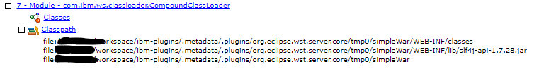
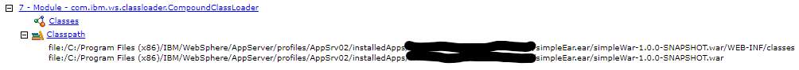

Fixed the problem with the IBM m2e plugins. When using looseconfig, they expect the JEE module to be called:

>artifactId-version.war

instead of the maven default of

>groupId-artifactId-version.war

I modified the war and ear maven plugin output filename mapping and the classpath layout to match this non maven standard way of doing things with the IBM plugins.

The problem introduced here is that the IBM loose configuration does not create a skinny war since the slf4j jars are in the war WEB-INF/lib folder in the binariesPath element of the WAR looseChildren in the looseconfig.xmi.

This appears at first sight as a very silly problem of little consequences.

The problem becomes significant when there are 60 jars and OpenJPA is used and all JARs are scanned.  This can cause a significant performance degradation at best and or very weird or unusual fatal interactions at worst.

The following screen shot demonstrate the WAS classpath when deploying this branch to WAS using the IBM plugins and with the settings "resources within the workspace":

The following screen shot demonstrates the WAS classpath when deploying this branch from a maven built artifact using the admin console install command:

You see that the admin console maven built example does not include the slf4j in the WAS classpath.  Rather the MANIFEST.MF's classpath entry has been modified to refer to the EAR lib folder copy.