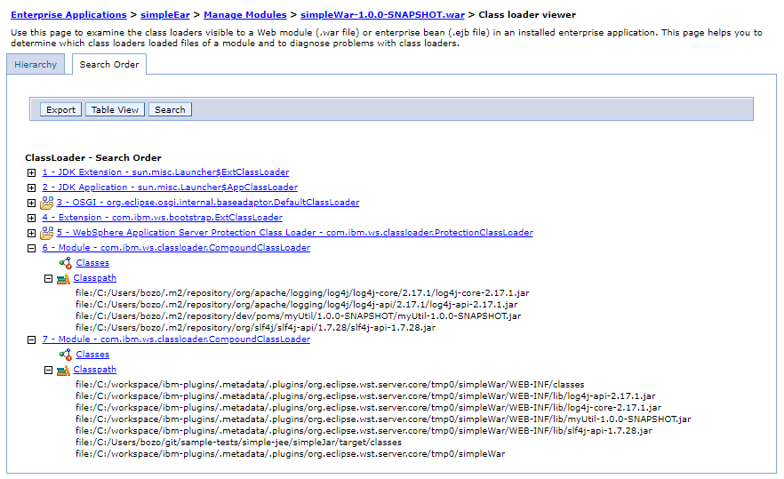

This example demonstrates the problem when deploying to WAS 8.5.5.14 using resources within the workspace. When the application is started, you will see an error with the ContextInit trying to load the super.properties file.  You will see the the classloader used to retrieve the super.properties is the application classloader and that for some reason the application classloader is missing the simpleJar, hence the failure.

Before deploying this branch to your local WAS you must delete the Eclipse project definition for the module myUtil (it must appear just like a simple folder in the simple-jee module.  Then run the Maven Build launch configuration `sample-tests install myUtil` using a JDK (WAS's JDK 8 will do) as your default workspace JRE (and also must be a selected as the JavaSE 1.8 execution environment).  This will install myUtil-1.0.0-SNAPSHOT.jar into your local maven repository.  This jar must come from the local repository and must not be a java module during the deploy with the IBM eclipse plugins for this problem to be reproduced.

The following screen shot illustrates this problem. This illustrates the WAS classpath when deploying this branch to WAS using the IBM plugins and with the settings "resources within the workspace":



The following will be printed just before the exception and confirms once again that the classloader is missing the simpleJar from the classpath:

```
[13/10/22 9:03:01:131 EDT] 000001bb SystemOut     O Classload= 
com.ibm.ws.classloader.CompoundClassLoader@3aca9d8e[app:application]
   Local ClassPath: C:\Users\bozo\.m2\repository\org\apache\logging\log4j\log4j-core\2.17.1\log4j-core-2.17.1.jar;C:\Users\bozo\.m2\repository\org\apache\logging\log4j\log4j-api\2.17.1\log4j-api-2.17.1.jar;C:\Users\bozo\.m2\repository\dev\poms\myUtil\1.0.0-SNAPSHOT\myUtil-1.0.0-SNAPSHOT.jar;C:\Users\bozo\.m2\repository\org\slf4j\slf4j-api\1.7.28\slf4j-api-1.7.28.jar
   Parent: com.ibm.ws.classloader.ProtectionClassLoader@4f39b0a4
   Delegation Mode: PARENT_FIRST
```
The following is the looseconfig.xmi in `C:\workspace\ibm-plugins\.metadata\.plugins\com.ibm.etools.wrd.websphere.v85\looseconfigurations\WebSphereApplicationServertraditionalV8.5atlocalhost\simpleEar` genereated by the latest IBM eclise 2020-06 plugins.  The loose config does contain an entry for the simpleJar in the EAR classloader (line 8):

```
<?xml version="1.0" encoding="UTF-8"?>
<org.eclipse.jst.j2ee.commonarchivecore.looseconfig:LooseArchive xmi:version="2.0" xmlns:xmi="http://www.omg.org/XMI" xmlns:org.eclipse.jst.j2ee.commonarchivecore.looseconfig="commonarchive.looseconfig.xmi" uri="C:\Users\bozo\git\sample-tests\simple-jee\simpleEar\src\main\application" binariesPath="C:\Users\bozo\git\sample-tests\simple-jee\simpleEar\src\main\application" resourcesPath="C:\Users\bozo\git\sample-tests\simple-jee\simpleEar\src\main\application" archiveType="EAR">
  <looseChildren uri="simpleWar-1.0.0-SNAPSHOT.war" binariesPath="C:/workspace/ibm-plugins/.metadata/.plugins/org.eclipse.wst.server.core/tmp0\simpleWar" resourcesPath="C:/workspace/ibm-plugins/.metadata/.plugins/org.eclipse.wst.server.core/tmp0\simpleWar" archiveType="WAR">
    <looseChildren uri="WEB-INF/lib/simpleJar.jar" binariesPath="C:\Users\bozo\git\sample-tests\simple-jee\simpleJar\target\classes" resourcesPath="C:\Users\bozo\git\sample-tests\simple-jee\simpleJar\target\classes" archiveType="SIMPLEJAR"/>
  </looseChildren>
  <looseChildren uri="lib/log4j-core-2.17.1.jar" binariesPath="C:\Users\bozo\.m2\repository\org\apache\logging\log4j\log4j-core\2.17.1\log4j-core-2.17.1.jar" resourcesPath="C:\Users\bozo\.m2\repository\org\apache\logging\log4j\log4j-core\2.17.1\log4j-core-2.17.1.jar" archiveType="SIMPLEJAR"/>
  <looseChildren uri="lib/log4j-api-2.17.1.jar" binariesPath="C:\Users\bozo\.m2\repository\org\apache\logging\log4j\log4j-api\2.17.1\log4j-api-2.17.1.jar" resourcesPath="C:\Users\bozo\.m2\repository\org\apache\logging\log4j\log4j-api\2.17.1\log4j-api-2.17.1.jar" archiveType="SIMPLEJAR"/>
  <looseChildren uri="lib/simpleJar-1.0.0-SNAPSHOT.jar" binariesPath="C:\Users\bozo\git\sample-tests\simple-jee\simpleJar\target\classes" resourcesPath="C:\Users\bozo\git\sample-tests\simple-jee\simpleJar\target\classes" archiveType="SIMPLEJAR"/>
  <looseChildren uri="lib/myUtil-1.0.0-SNAPSHOT.jar" binariesPath="C:\Users\bozo\.m2\repository\dev\poms\myUtil\1.0.0-SNAPSHOT\myUtil-1.0.0-SNAPSHOT.jar" resourcesPath="C:\Users\bozo\.m2\repository\dev\poms\myUtil\1.0.0-SNAPSHOT\myUtil-1.0.0-SNAPSHOT.jar" archiveType="SIMPLEJAR"/>
  <looseChildren uri="lib/slf4j-api-1.7.28.jar" binariesPath="C:\Users\bozo\.m2\repository\org\slf4j\slf4j-api\1.7.28\slf4j-api-1.7.28.jar" resourcesPath="C:\Users\bozo\.m2\repository\org\slf4j\slf4j-api\1.7.28\slf4j-api-1.7.28.jar" archiveType="SIMPLEJAR"/>
</org.eclipse.jst.j2ee.commonarchivecore.looseconfig:LooseArchive>
```